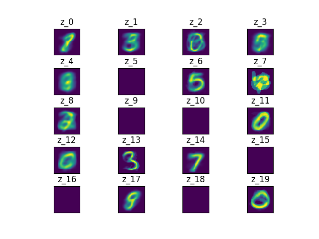

# Homework 4
CSCI 2820-001

Zachary Lefin

<div style="page-break-after: always;"></div>

# k-Means Algorithm Implementation

Source available on [Github](https://github.com/Sn00pbom/Spring2020_LinalgHW4_kMeans)

For this project, I used Python for my implementation of the k-means algorithm.


I used the following imports:

```python
import struct
from datetime import datetime

import numpy as np
from numpy import array, ndarray
from numpy import linalg as LA
from matplotlib import pyplot as plt
```

- *struct* to unpack and load MNIST data into np arrays
- *datetime* to name output image files at runtime.
- *numpy* to take advantage of it's faster array computations and linear algebra library so I could use a faster version of norm than if I were to implement it using native lists.
- *matplotlib* to generate zⱼ representative images

## k-means Object
I defined the following data structure to perform k-means in an easily manageable object:

```python
class kMeans(object):
    """
    k-Means algorithm object.

    Steps are computed using 'next'

    Attributes:
    x: N-vector of n-vectors
    k: number of groups
    n: size of xᵢ
    N: size of x
    c: grouping such that cᵢ = Group(xᵢ)
    z: group representatives z₁,....,zₖ
    """

    def __init__(self, x, z):
        """Initialize k-means on vectors xᵢ with k groups"""
        self.x = x
        self.k = len(z)  # k depends on initial z that is passed
        self.n = len(x[0])  # number of entries in each n-vector
        self.N = len(x)  # number of n-vectors

        self.c = np.random.randint(0,self.k,self.N)  # init random group assignments
        self.z = z

    def __next__(self):
        """Update step - groups then reps. Returns computed error Jᶜˡᶸˢᵗ"""
        self._update_groups()  # put xᵢ into group by cᵢ by smallest distance in z
        self._update_reps()  # set each group rep zⱼ to mean of it's group or 0 if empty group
        return self.Jclust()  # compute and return error

    def _G(self, j):
        """Return array of vectors in group j → {xᵢ | cᵢ = j}, ∀ i ∈ N"""
        return array([self.x[i] for i in range(self.N) if self.c[i] == j])

    def _update_groups(self):
        """Set each cᵢ to argmin(||xᵢ - z₁||,...,||xᵢ - zⱼ||), ∀ i ∈ N"""
        for i in range(self.N):
            # Compute argmin(||xᵢ - z₁||,...,||xᵢ - zⱼ||)
            jmin = np.argmin(array([self.dist(self.x[i], self.z[j]) for j in range(self.k)]))
            # Set cᵢ
            self.c[i] = jmin

    def _update_reps(self):
        """Set each zⱼ to avg(Gⱼ) if Gⱼ not empty else 0ₙ, ∀ j ∈ k"""
        for j in range(self.k):
            # Get group Gⱼ
            Gj = self._G(j)
            # Set zⱼ
            self.z[j] = np.zeros(self.n) if len(Gj) == 0 else np.mean(Gj, axis=0)

    def Jclust(self):
        """Compute and return sum of square distances over N, ∀ i ∈ N → ∑(||xᵢ - zcᵢ||²)/N"""
        tot = 0.0
        for i in range(self.N):
            xi = self.x[i]
            zci = self.z[self.c[i]]
            tot += self.dist(xi, zci)**2
        tot /= self.N
        return tot

    @staticmethod
    def dist(a, b):
        """Compute and return ||a - b|| = √((a₁-b₁)² + ... + (aN-bN)²)"""
        return LA.norm(a-b)
```
## $x$ data
I used the following code to load $x_1,...,x_N$ from the [MNIST training set](http://yann.lecun.com/exdb/mnist/train-images-idx3-ubyte.gz). Each vector entry is a 784-vector when the 2d image arrays are reshaped to 1 dimension.

```python
# Load MNIST into x array of n-vectors
with open('train-images-idx3-ubyte', 'rb') as f:
    # As per specification on the MNIST source site
    # first four bytes are magic number
    # second four bytes are size of array
    _, size = struct.unpack(">II", f.read(8))
    # third four bytes are nrows
    # fourth four bytes are ncols
    nrows, ncols = struct.unpack(">II", f.read(8))
    print(nrows*ncols, 'entries')
    # Rest is data, load directly into numpy
    x = np.fromfile(f, dtype=np.dtype(np.uint8).newbyteorder('>'))
    # Reshape into "size" nrows*ncols-vectors
    x = x.reshape((size, nrows*ncols))
```
## $z$ data
I used the following code to load $z_1,...,z_k$ from local randomly generated [`z.csv`](z.csv). Each $z_i$ has the same shape as $x_i$.
```python
# Load z initial state from csv
with open('z.csv', 'r') as f:
    z = f.read()  # read string
    z = z.split('\n')  # split string into array by newline
    z = [s.split(',') for s in z]  # split strings in array into arrays by comma
    z = array(z, dtype='float')  # convert to numpy array
```
## Running the algo
Lastly, I used the following code to instantiate a kMeans object, step through each k-means round, and save the output $z$ representative images.

```python
# Init k-means object with vector array x and k groups
km = kMeans(x, z)

def gen_imgs():
    """Save reps to image"""
    fig, axes = plt.subplots(5, 4, subplot_kw={'xticks': [], 'yticks': []})
    fig.subplots_adjust(hspace=0.5)
    for ax, zi, j in zip(axes.flat, km.z, range(len(z))):
        ax.imshow(zi.reshape((nrows, ncols)))
        ax.set_title("z_{}".format(j))
    plt.savefig(datetime.now().strftime('./img/%M-%S.png'), format='png')

# loop until 2 consecutive runs have same value
last = -1
curr = 0
count = 0
while curr != last:
    gen_imgs()
    print('Jclust', count, km.Jclust())
    last = curr
    curr = next(km)
    count += 1
gen_imgs()
```

# Result
The initial value of $J^{clust}$ with my initial random $z$ from the file was about 16 million. Interesingly, after only 1 step it shaved off a massive 13 million resulting in only about 3 million.


The initial $z$ group was complete random noise


After only 1 step, images loosely resembling numbers became quite clear.



However, there were still several representative groups that were completely 0.

But as time continued, they continued to fill in.


As it continued to run, I noticed a pattern that the difference between each sequential run became smaller and smaller.

About $\frac{2}{3}$ of the way through, the progress started to seem very insignificant, and the numbers were much more clear


Eventually, after 116 steps of updating groups and reps, the next step yielded the same result and the loop quit. Interestingly, the $J^{clust}$ value was still quite high.


The final result after the value of $J^{clust}$ had converged to the limit of floating point was as follows:


The numbers are mostly very clear except for a few cases where there's a "bridge" between two lines e.g. in z_9 (is it 4 or 9)?

All of the images generated at each step can be found [here](./img)